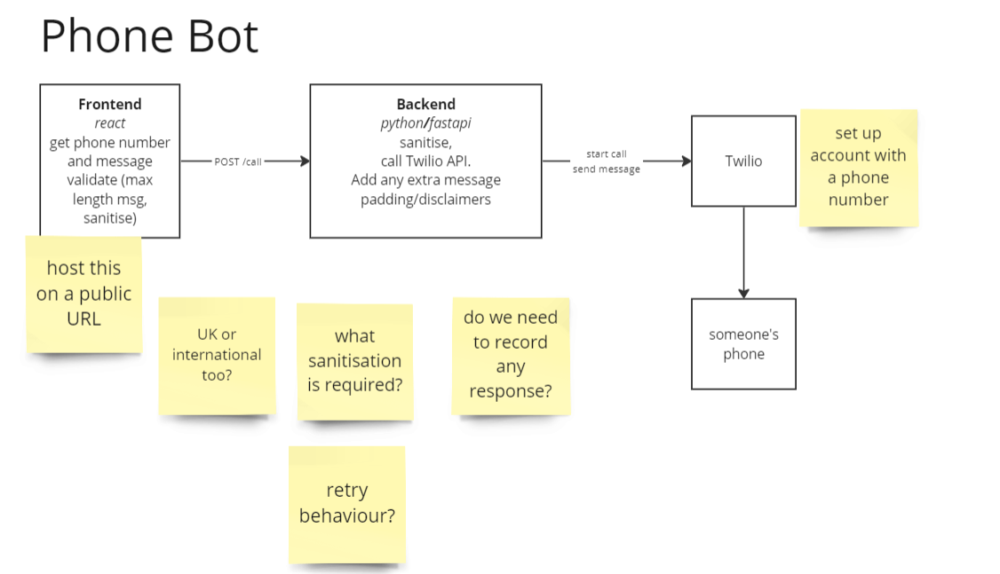

# Phone Bot

This repo contains a bot to call people and read out messages.

Architecture diagram: https://miro.com/app/board/o9J_l0HycFU=/?moveToWidget=3458764580554678026&cot=14

# Getting started (ubuntu)
Pro tip: on windows, run `wsl --install` to get a list of distros. I went for `Ubuntu-22.04`. Then get the VSCode plugin and start coding in the linux env.


> NOTE: Need to add the node source before you install, otherwise you'll get hit by a VERY old node
> NOTE2: I had to 
```
curl -sL https://deb.nodesource.com/setup_18.x | sudo -E bash -
sudo apt-get update && sudo apt-get install -y python3-venv nodejs npm 
```

set up your venv (ubuntu)
```bash
python3 -m venv testenv
source venv/bin/activate
pip install -r requirements.txt
```

and run the tests
```bash
pytest
```
### node
```
cd webapp
npm start
```


## To do list
1. DONE Do twilio python tutorial DONE
2. DONE update python to actually send the correct message
3. DONE send requirements clarifications
4. DONE do react app
5. DONE make dockerfile
6. DONE setup gcloud env with cloud run, secret mgment, and IP addr
7. deploy

## questions
- where to host the app? heroku vs gcloud

## design
write a build script for the react app that produces a set of static files. Static files are then loaded into the 
docker image and served by fastapi. Host with cloud run or heroku. 

see `work_log.md` for notes